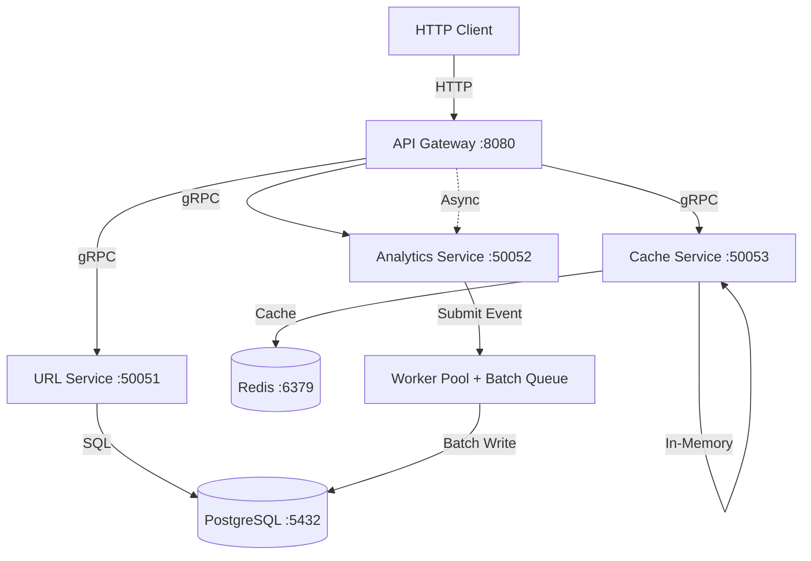
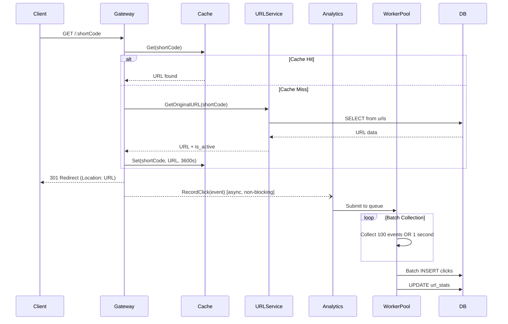
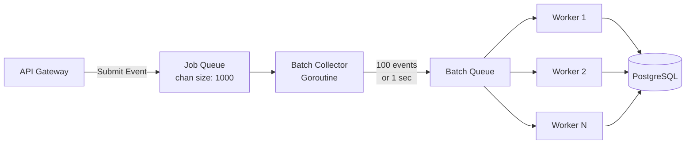

# URL Shortener - Техническое задание

## Описание проекта

Микросервисная система для сокращения URL-адресов с аналитикой переходов. Система должна обрабатывать высокие нагрузки за счет асинхронной обработки событий, кэширования и батчевой записи в БД.

## Функциональные требования

### Основная функциональность
- Создание коротких ссылок из длинных URL
- Редирект по короткому коду на оригинальный URL
- Сбор статистики кликов (общее количество, уникальные посетители)
- Удаление коротких ссылок
- Опциональный срок действия ссылок

### Нефункциональные требования
- **Производительность**: Редирект должен выполняться < 10ms
- **Масштабируемость**: Поддержка 10,000+ запросов/сек на редирект
- **Асинхронность**: Запись кликов не должна блокировать редирект
- **Отказоустойчивость**: Graceful shutdown с сохранением необработанных данных

## Технологический стек

### Обязательные технологии
- **Язык**: Go 1.21+
- **БД**: PostgreSQL 14+
- **Кэш**: Redis 7+
- **RPC**: gRPC + Protocol Buffers
- **HTTP**: Gin или аналог
- **Миграции**: golang-migrate
- **Query Builder**: squirrel или аналог
- **Контейнеризация**: Docker + Docker Compose

### Архитектурные требования
- Микросервисная архитектура (минимум 4 сервиса)
- Worker Pool для асинхронной обработки
- Circuit Breaker для отказоустойчивости
- Rate Limiting
- Двухуровневое кэширование (Redis + in-memory)

## Архитектура системы



## Структура микросервисов

### 1. API Gateway (HTTP → gRPC)
**Порт**: 8080  
**Задачи**:
- Прием HTTP запросов
- Маршрутизация к gRPC сервисам
- Rate Limiting (100 req/min на IP)
- Асинхронная отправка событий кликов

### 2. URL Service (gRPC)
**Порт**: 50051  
**Задачи**:
- Генерация уникальных коротких кодов (7 символов, a-zA-Z0-9)
- CRUD операции над URL
- Проверка срока действия ссылок

### 3. Analytics Service (gRPC)
**Порт**: 50052  
**Задачи**:
- Прием событий кликов через gRPC
- Worker Pool (10 воркеров) для обработки очереди
- Батчевая запись в БД (100 событий или 1 секунда)
- Расчет статистики

### 4. Cache Service (gRPC)
**Порт**: 50053  
**Задачи**:
- Двухуровневый кэш (Redis + in-memory)
- TTL управление
- Автоматическая инвалидация

## API Endpoints

### HTTP REST API (API Gateway)

| Метод | Путь | Описание | Статус коды |
|-------|------|----------|-------------|
| POST | `/shorten` | Создать короткую ссылку | 200, 400, 500 |
| GET | `/:shortCode` | Редирект на оригинальный URL | 301, 404, 410, 500 |
| GET | `/stats/:shortCode` | Получить статистику | 200, 500 |
| DELETE | `/:shortCode` | Удалить ссылку | 200, 500 |

### POST /shorten

**Request Body**:
```
{
  "url": string (required, valid URL),
  "user_id": string (optional),
  "expires_in_days": integer (optional, > 0)
}
```

**Response 200**:
```
{
  "short_code": string,
  "short_url": string
}
```

### GET /:shortCode

**Response**: HTTP 301 Redirect с заголовком Location  
**Response 404**: URL не найден  
**Response 410**: URL истек

### GET /stats/:shortCode

**Response 200**:
```
{
  "short_code": string,
  "total_clicks": integer,
  "unique_visitors": integer,
  "last_clicked_at": string (RFC3339 или пусто)
}
```

### DELETE /:shortCode

**Response 200**:
```
{
  "success": boolean
}
```

## Схема базы данных

### Таблица: urls

| Поле | Тип | Ограничения | Описание |
|------|-----|-------------|----------|
| id | BIGSERIAL | PRIMARY KEY | Уникальный идентификатор |
| short_code | VARCHAR(10) | UNIQUE NOT NULL | Короткий код |
| original_url | TEXT | NOT NULL | Оригинальный URL |
| created_at | TIMESTAMP | DEFAULT NOW() | Дата создания |
| expires_at | TIMESTAMP | NULL | Дата истечения (опционально) |
| user_id | VARCHAR(50) | NULL | ID пользователя |
| is_active | BOOLEAN | DEFAULT true | Активна ли ссылка |

**Индексы**:
- `idx_short_code` на `short_code`
- `idx_created_at` на `created_at`

### Таблица: clicks

| Поле | Тип | Ограничения | Описание |
|------|-----|-------------|----------|
| id | BIGSERIAL | PRIMARY KEY | Уникальный идентификатор |
| short_code | VARCHAR(10) | NOT NULL | Короткий код |
| clicked_at | TIMESTAMP | NOT NULL DEFAULT NOW() | Время клика |
| ip_address | INET | NULL | IP адрес |
| user_agent | TEXT | NULL | User-Agent браузера |
| referer | TEXT | NULL | HTTP Referer |
| country | VARCHAR(2) | NULL | Код страны (ISO) |

**Индексы**:
- `idx_clicks_short_code` на `short_code`
- `idx_clicks_clicked_at` на `clicked_at`
- `idx_clicks_ip_address` на `ip_address`

### Таблица: url_stats

| Поле | Тип | Ограничения | Описание |
|------|-----|-------------|----------|
| short_code | VARCHAR(10) | PRIMARY KEY | Короткий код |
| total_clicks | BIGINT | NOT NULL DEFAULT 0 | Общее количество кликов |
| unique_visitors | BIGINT | NOT NULL DEFAULT 0 | Уникальные посетители |
| last_clicked_at | TIMESTAMP | NULL | Последний клик |
| updated_at | TIMESTAMP | NOT NULL DEFAULT NOW() | Время обновления |

**Индекс**:
- `idx_url_stats_updated_at` на `updated_at`

## gRPC Services (Protocol Buffers)

### URLService

```
service URLService {
  rpc CreateShortURL(CreateURLRequest) returns (CreateURLResponse)
  rpc GetOriginalURL(GetURLRequest) returns (GetURLResponse)
  rpc DeleteURL(DeleteURLRequest) returns (DeleteURLResponse)
}
```

### AnalyticsService

```
service AnalyticsService {
  rpc RecordClick(ClickEvent) returns (ClickResponse)
  rpc GetStatistics(StatsRequest) returns (StatsResponse)
}
```

### CacheService

```
service CacheService {
  rpc Get(CacheGetRequest) returns (CacheGetResponse)
  rpc Set(CacheSetRequest) returns (CacheSetResponse)
  rpc Delete(CacheDeleteRequest) returns (CacheDeleteResponse)
}
```

## Алгоритм обработки клика



## Конкурентность и производительность

### Worker Pool Architecture



### Требования к асинхронности
- Редирект НЕ должен ждать записи клика в БД
- Используйте buffered channels размером 1000+ для jobQueue
- Worker pool: 10 горутин-воркеров
- Батчинг: 100 событий ИЛИ 1 секунда (что наступит раньше)
- Graceful shutdown: flush всех батчей перед остановкой

### Кэширование
- **L1 (in-memory)**: 5 минут TTL, очистка каждую минуту
- **L2 (Redis)**: 1 час TTL
- **Стратегия**: Cache-aside pattern
- **Инвалидация**: При удалении URL из обоих уровней

## Docker Compose конфигурация

### Сервисы
- `postgres`: PostgreSQL 15 Alpine
- `redis`: Redis 7 Alpine
- `url-migrations`: Запуск миграций для URL Service
- `analytics-migrations`: Запуск миграций для Analytics Service
- `url-service`: URL Service (зависит от postgres + migrations)
- `analytics-service`: Analytics Service (зависит от postgres + migrations)
- `cache-service`: Cache Service (зависит от redis)
- `api-gateway`: API Gateway (зависит от всех сервисов)

### Health checks
- PostgreSQL: `pg_isready -U urlshortener` каждые 5 секунд
- Redis: `redis-cli ping` каждые 5 секунд

### Volumes
- `postgres_data` для персистентности БД

### Network
- Все сервисы в одной сети `app-network`

## Дополнительные компоненты

### Rate Limiter
- In-memory implementation с token bucket алгоритмом
- 100 запросов в минуту на IP
- Middleware для Gin
- Автоматическая очистка старых bucket'ов

### Circuit Breaker
- Состояния: Closed, Open, Half-Open
- Max failures: настраиваемый порог
- Reset timeout: настраиваемый период
- Используется для gRPC вызовов

### Генератор коротких кодов
- Длина: 7 символов
- Charset: a-z, A-Z, 0-9 (62 символа)
- Криптографически безопасный random (crypto/rand)
- Collision handling: до 5 попыток генерации

## Makefile команды

Должны быть реализованы следующие команды:

| Команда | Описание |
|---------|----------|
| `make proto` | Генерация Go кода из .proto файлов |
| `make up` | Запуск всех сервисов через docker-compose |
| `make down` | Остановка и удаление контейнеров |
| `make logs` | Просмотр логов всех сервисов |
| `make test` | Запуск тестов с race detector |
| `make clean` | Очистка артефактов |

## Тестирование

### Unit тесты
- Покрытие > 70%
- Race detector: `go test -race`
- Тестирование worker pool и батчинга

### Load тесты
- Apache Bench или аналог
- 10,000 запросов на редирект за < 5 секунд
- Проверка размера очереди и количества горутин

### Проверка корректности
- Batch insert должен срабатывать при 100 событиях
- Batch insert должен срабатывать через 1 секунду
- Graceful shutdown сохраняет все события
- Статистика корректна после нагрузочного теста

## Критерии оценки

### Минимум (проходной балл)
- ✅ Все 4 микросервиса работают
- ✅ Docker Compose поднимает систему
- ✅ POST /shorten создает ссылки
- ✅ GET /:shortCode редиректит
- ✅ Миграции применяются автоматически
- ✅ Redis кэширует URL

### Хорошо
- ✅ + Worker pool с батчингом работает
- ✅ + Редирект не блокируется записью клика
- ✅ + Rate limiting функционирует
- ✅ + Graceful shutdown
- ✅ + go test -race проходит без ошибок

### Отлично
- ✅ + Load test: > 5000 req/s на редирект
- ✅ + Двухуровневое кэширование
- ✅ + Circuit breaker для gRPC
- ✅ + Метрики: количество горутин, размер очереди
- ✅ + Код структурирован по слоям (handler/service/repository)

## Подсказки по реализации

### Структура проекта
```
project/
├── services/
│   ├── api-gateway/
│   ├── url-service/
│   ├── analytics-service/
│   └── cache-service/
├── proto/
│   └── *.proto
├── pkg/
│   ├── shortcode/
│   ├── ratelimit/
│   └── circuitbreaker/
├── docker-compose.yml
├── Makefile
└── go.mod
```

### Ключевые пакеты для использования
- `github.com/gin-gonic/gin` - HTTP router
- `google.golang.org/grpc` - gRPC
- `google.golang.org/protobuf` - Protocol Buffers
- `github.com/lib/pq` - PostgreSQL driver
- `github.com/go-redis/redis/v8` - Redis client
- `github.com/Masterminds/squirrel` - SQL query builder

### Важные детали реализации
- Используйте `context.WithTimeout` для всех gRPC вызовов (5 секунд)
- Connection pooling: `SetMaxOpenConns(25)`, `SetMaxIdleConns(5)`
- Redis connection pool: `PoolSize: 10`
- Buffered channels для очередей
- `sync.WaitGroup` для graceful shutdown
- Timer + Ticker для периодического flush батчей

---

**Примечание**: Это задание требует понимания конкурентности в Go, паттернов микросервисной архитектуры и оптимизации производительности. Все решения должны быть реализованы самостоятельно, без копирования готового кода.
